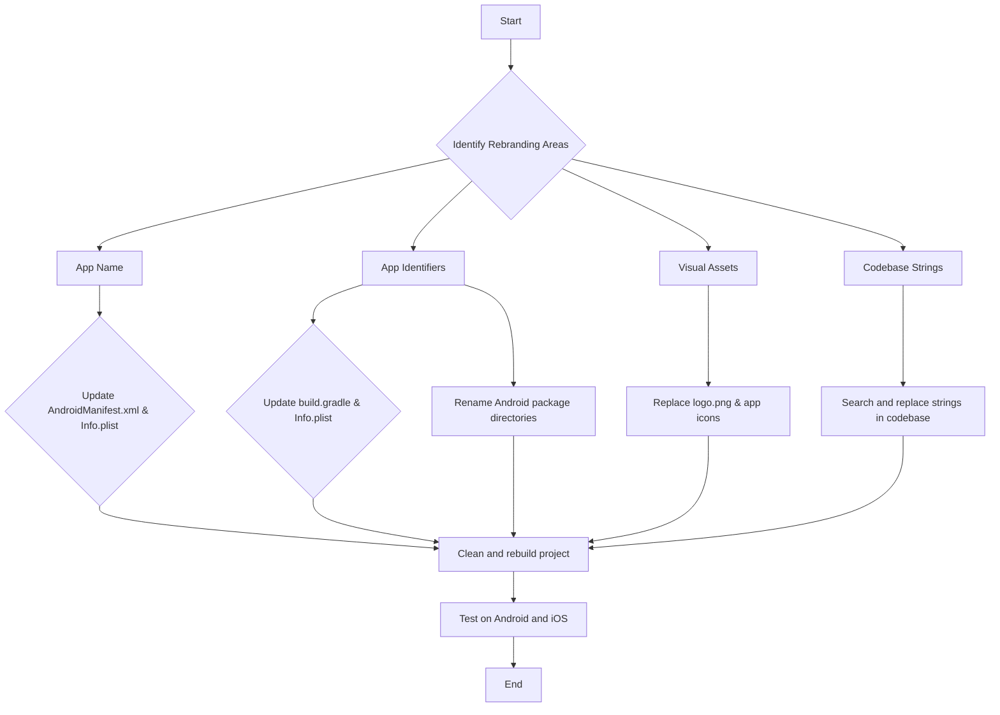

# FlutterConf App Rebranding Modification Design

## Overview

This document outlines the design for rebranding the "Flutter & Friends" conference app to "FlutterConf". This includes changing the app's name, identifiers, visual assets, and all user-facing strings that refer to the old brand.

## Detailed Analysis of the Goal or Problem

The goal is to completely rebrand the existing application from "Flutter & Friends" to "FlutterConf". This is not just a simple string replacement, but a comprehensive change that affects the app's identity across different platforms (iOS and Android) and its visual presentation.

The key areas to address are:

1.  **Application Name:** The name displayed on the user's home screen and within the app must be changed from "Flutter & Friends" to "FlutterConf".
2.  **Application Identifiers:** The unique identifiers for the app on both Android (`applicationId`) and iOS (`PRODUCT_BUNDLE_IDENTIFIER`) must be updated to `es.flutterconf.app`. This is crucial for app store listings and updates.
3.  **Visual Assets:** All logos, icons, and other brand-specific imagery need to be replaced with new "FlutterConf" assets. Initially, these will be placeholder assets.
4.  **Codebase Strings:** All hardcoded strings in the Dart code that refer to "Flutter & Friends" must be updated to "FlutterConf".
5.  **Configuration Files:** Various configuration files for Android, iOS, and the Flutter project itself will need to be updated to reflect the new name and identifiers.

## Alternatives Considered

### Manual vs. Automated Rebranding

*   **Manual Approach:** This involves manually finding and replacing all occurrences of the old brand name and identifiers. This approach provides full control but is tedious and prone to human error. Given the number of files to modify, it's easy to miss something.
*   **Automated Approach:** Using a combination of scripts and IDE features to perform the renaming. For package name changes, there are third-party packages like `change_app_package_name` that can automate the process.

This design will use a hybrid approach. For the application identifiers, we will use an automated approach where possible to avoid errors. For text and asset replacements, a more manual (but tool-assisted) approach will be used to ensure correctness and context.

## Detailed Design for the Modification

The modification will be performed in a structured manner to ensure all aspects of the rebranding are covered.

### 1. Application Name Change

-   **Android:** Modify `android/app/src/main/AndroidManifest.xml` to change the `android:label` attribute in the `<application>` tag to "FlutterConf".
-   **iOS:** Modify `ios/Runner/Info.plist` to change the `CFBundleName` string value to "FlutterConf".

### 2. Application Identifier Change

-   **Android:**
    1.  Modify `android/app/build.gradle` to change the `applicationId` in the `defaultConfig` block to `es.flutterconf.app`.
    2.  Modify `android/app/src/main/AndroidManifest.xml` to change the `package` attribute in the `<manifest>` tag to `es.flutterconf.app`.
    3.  Rename the directory structure under `android/app/src/main/kotlin` (or `java`) to match the new package name. For example, if the old package was `dev.flutterandfriends.app`, the new structure will be `es/flutterconf/app`.
    4.  Update the `package` declaration in `MainActivity.kt` (or `MainActivity.java`).
-   **iOS:**
    1.  Modify `ios/Runner/Info.plist` to change the `CFBundleIdentifier` string value to `es.flutterconf.app`.
    2.  Modify `ios/Runner.xcodeproj/project.pbxproj` to update the `PRODUCT_BUNDLE_IDENTIFIER` to `es.flutterconf.app`. This is best done via Xcode, but can be done with a careful find-and-replace.

### 3. Visual Asset Replacement

-   **Logo:** The existing `assets/logo.png` will be replaced with a placeholder logo for "FlutterConf".
-   **App Icons:** The platform-specific app icons will be replaced with placeholder icons. This involves updating the `ic_launcher.png` files in various `mipmap` directories for Android, and the `AppIcon` image set in `ios/Runner/Assets.xcassets` for iOS.

### 4. Codebase String and File Content Replacement

-   A global search for "Flutter & Friends" (and variations like "flutterandfriends") will be performed across the entire project.
-   All occurrences will be replaced with "FlutterConf" (or `flutterconf` for code-style references).
-   This includes, but is not limited to:
    -   `pubspec.yaml`: The `name` and `description` of the package.
    -   `README.md`: The project title and description.
    -   Dart files in the `lib/` directory.
    -   Configuration files in the `.github/` directory.

## Diagrams

### Rebranding Process Flow

## Summary of the Design

This design document proposes a comprehensive plan to rebrand the "Flutter & Friends" app to "FlutterConf". The plan covers changes to the app's name, identifiers, visual assets, and codebase strings. It advocates for a hybrid approach of automated and manual changes to ensure accuracy and completeness. The process will be followed by a thorough cleaning, rebuilding, and testing of the application on both Android and iOS platforms.

## References

-   [How to change your package name in Flutter](https://medium.com/flutter-community/how-to-change-your-package-name-in-flutter-97b355c1f43c)
-   [Renaming a Flutter app](https://docs.flutter.dev/deployment/android#renaming-the-package)
