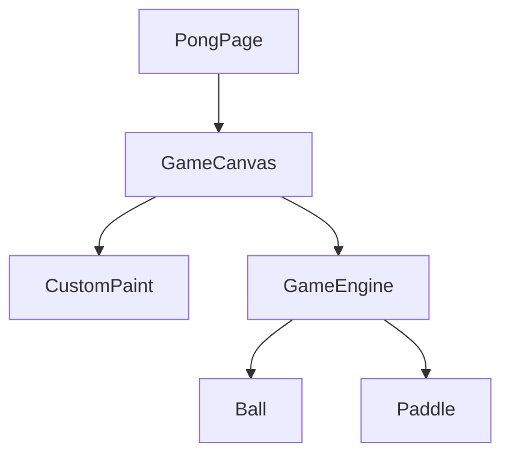

# Diseño de Modificación: Juego de Pong con Temática de Dardo

## Descripción General

Esta modificación introduce una nueva función en la aplicación FlutterConf: un sencillo juego de Pong con una temática de Dart/Flutter. El juego se podrá jugar en una nueva pestaña de la aplicación.

## Análisis Detallado

El objetivo es crear un juego de Pong simple y divertido que se integre en la aplicación existente. Los requisitos son:

- El juego debe estar en una nueva pestaña.
- La pelota del juego será Dash, la mascota de Flutter.
- El juego tendrá un marcador de puntuación.
- El jugador controlará una paleta para golpear la pelota.
- La otra paleta será controlada por una IA simple.

## Alternativas Consideradas

### Usando un Motor de Juegos como Flame

Flame es un popular motor de juegos para Flutter. Proporciona un bucle de juego, detección de colisiones, sprites y otras características útiles que podrían acelerar el desarrollo.

- **Ventajas:** Desarrollo más rápido, más características (si se desean en el futuro), buena documentación.
- **Desventajas:** Añade una nueva dependencia considerable a la aplicación, lo que podría aumentar el tamaño de la misma. Para un juego tan simple como el Pong, puede ser una exageración.

### Usando un `StatefulWidget` y `CustomPaint`

Este enfoque implica construir el juego desde cero utilizando las herramientas que Flutter proporciona de forma nativa.

- **Ventajas:** No se necesitan dependencias adicionales, control total sobre el código, es una buena oportunidad para aprender sobre bucles de juego y renderizado personalizado en Flutter.
- **Desventajas:** Requiere más código para escribir, la detección de colisiones y la física del juego deben ser implementadas manualmente.

### Decisión

Para este caso, la simplicidad es clave. Dado que el juego de Pong es relativamente simple, el enfoque de `StatefulWidget` y `CustomPaint` es el más adecuado. Evita añadir dependencias innecesarias y mantiene el código base ligero.

## Diseño Detallado

### Estructura de Archivos

Se creará un nuevo directorio de características en `lib/pong/` con la siguiente estructura:

```
lib/
└── pong/
    ├── view/
    │   └── pong_page.dart
    ├── widgets/
    │   └── game_canvas.dart
    ├── components/
    │   ├── ball.dart
    │   └── paddle.dart
    └── engine/
        └── game_engine.dart
```

- `pong_page.dart`: Será la página principal del juego, accesible desde una nueva pestaña.
- `game_canvas.dart`: Un `StatefulWidget` que contendrá el bucle de juego y usará un `CustomPaint` para renderizar el juego.
- `ball.dart`: Una clase que representa la pelota (Dash).
- `paddle.dart`: Una clase que representa las paletas.
- `game_engine.dart`: Contendrá la lógica del juego, como el movimiento de la pelota y las paletas, la detección de colisiones y la puntuación.

### Lógica del Juego

- **Bucle de Juego:** Se usará un `AnimationController` como el bucle de juego principal para actualizar el estado del juego en cada fotograma.
- **Renderizado:** Un `CustomPaint` dibujará los elementos del juego (paletas, pelota, puntuación) en el lienzo.
- **Entrada del Usuario:** Un `GestureDetector` detectará los gestos de arrastre del usuario para mover la paleta del jugador.
- **IA del Oponente:** La paleta del oponente seguirá la posición 'y' de la pelota con un ligero retraso para que sea posible ganarle.

### Tematización

- **La Pelota:** Se usará una imagen de Dash. La imagen se descargará de [esta URL](https://upload.wikimedia.org/wikipedia/commons/4/47/Dash_the_dart_mascot.png) y se añadirá a los assets de la aplicación.
- **Las Paletas:** Serán rectángulos simples, con el color primario del tema de la aplicación para que coincida con el estilo general.
- **Fondo:** Un color de fondo oscuro que contraste bien con los elementos del juego.

### Navegación

Se añadirá una nueva entrada a la navegación principal de la aplicación. Será necesario investigar la implementación actual de la navegación (usando `go_router`) para añadir la nueva pestaña `Pong`.

### Diagramas



## Resumen

El diseño propone una implementación autónoma y sencilla de un juego de Pong dentro de la aplicación, utilizando las herramientas nativas de Flutter. Esto minimiza el impacto en el resto de la aplicación y evita dependencias externas.

## Referencias

- [Building a Simple Game in Flutter](https://docs.flutter.dev/ui/layout/tutorial)
- [CustomPaint in Flutter](https://api.flutter.dev/flutter/widgets/CustomPaint-class.html)
- [AnimationController Class](https://api.flutter.dev/flutter/animation/AnimationController-class.html)